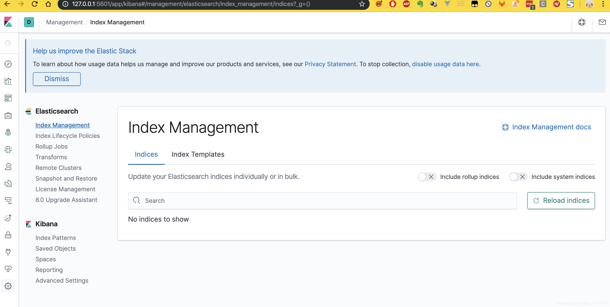

# ELK

[参考文档](https://blog.csdn.net/qq_21019419/article/details/103630081)

[DockerHub](https://hub.docker.com/search?type=image)

## 下载Docker镜像

```shell
docker pull redis:6.2.6
docker pull nginx:1.21.5
docker pull mysql:8.0.28
docker pull wurstmeister/zookeeper
docker pull wurstmeister/kafka
docker pull elasticsearch:7.16.3
docker pull kibana:7.16.3
docker pull logstash:7.16.3
```

## 构建容器

1. 构建logstash的配置文件

   ```conf
   input {
     tcp {
       mode => "server"
       host => "0.0.0.0"
       port => 4560
       codec => json_lines
     }
   }
   output {
     elasticsearch {
       hosts => "es:9200"
       index => "springboot-logstash-%{+YYYY.MM.dd}"
     }
   }
   ```
   
2. 构建elasticsearch，使用docker-compose.yml构建

   ```yaml
   version: '3'
   services:
     elasticsearch:
       image: elasticsearch:7.16.3
       container_name: elasticsearch
       networks:
         elk_net:
           aliases:
             - elasticsearch
       environment:
         - "cluster.name=elasticsearch" #设置集群名称为elasticsearch
         - "discovery.type=single-node" #以单一节点模式启动
         - "ES_JAVA_OPTS=-Xms512m -Xmx1024m" #设置使用jvm内存大小
         - "TZ=Asia/Shanghai"
       volumes:
         - /Users/voishion/work/server/docker/elasticsearch/plugins:/usr/share/elasticsearch/plugins
         - /Users/voishion/work/server/docker/elasticsearch/data:/usr/share/elasticsearch/data
         - /Users/voishion/work/server/docker/elasticsearch/logs:/usr/share/elasticsearch/logs
       ports:
         - "9200:9200"
         - "9300:9300"
   
     kibana:
       image: kibana:7.16.3
       container_name: kibana
       networks:
         elk_net:
           aliases:
             - kibana
       links:
         - elasticsearch:es #可以用es这个域名访问elasticsearch服务
       depends_on:
         - elasticsearch #kibana在elasticsearch启动之后再启动
       environment:
         - "elasticsearch.hosts=http://es:9200" #设置访问elasticsearch的地址
         - "TZ=Asia/Shanghai"
       ports:
         - "5601:5601"
   
     logstash:
       image: logstash:7.16.3
       container_name: logstash
       networks:
         elk_net:
           aliases:
             - logstash
       links:
         - elasticsearch:es #可以用es这个域名访问elasticsearch服务
       volumes:
         - /Users/voishion/work/server/docker/logstash/pipeline/logstash-springboot.conf:/usr/share/logstash/pipeline/logstash.conf #挂载logstash的配置文件
       depends_on:
         - elasticsearch #kibana在elasticsearch启动之后再启动
       environment:
         - "xpack.monitoring.elasticsearch.hosts=http://es:9200" # 解决logstash监控连接报错
         - "TZ=Asia/Shanghai"
       ports:
         - "4560:4560"
   
   networks:
     elk_net:
       driver: bridge
   ```

3. 跑起来

   ```shell
   docker-compose up -d --build
   docker-compose up -d --build elasticsearch
   docker-compose up -d --build kibana
   docker-compose up -d --build logstash
   ```

4. 需要等待elasticsearch跑起来，大概几分钟，访问 [Kibana](http://localhost:5601/app/home#/)

5. 如果出现错误，可以查看docker的日志

   ```shell
   docker logs elasticsearch
   ```

   一般出错大部分是内存不足导致的

   

6. elasticsearch安装分词器

   > 第一种安装方法，如果下载速度很慢，可能超时或者失败

   ```shell
   docker exec -it elasticsearch bash
   # 安装
   ./bin/elasticsearch-plugin install https://github.com/medcl/elasticsearch-analysis-ik/releases/download/v7.16.3/elasticsearch-analysis-ik-7.16.3.zip
   # 退出容器
   exit
   # 重启logstash服务
   docker restart elasticsearch
   ```

   > 第二种安装方法，先本地下载好文件

   ```shell
   
   # 将下载解压的文件，copy到容器中，
   docker cp /Users/voishion/work/plugins/elasticsearch-analysis-ik-7.16.3 elasticsearch:/root
   # 进入容器
   docker exec -it elasticsearch /bin/bash
   # 创建分词器插件目录
   mkdir /usr/share/elasticsearch/plugins/ik/
   # 拷贝插件
   cd /root/
   cp -r elasticsearch-analysis-ik-7.16.3/* /usr/share/elasticsearch/plugins/ik/
   # 退出容器
   exit
   # 重启logstash服务
   docker restart elasticsearch
   ```

7. 在logstash中插件管理

   ```shell
   # 列出所有已安装插件
   bin/logstash-plugin list 
   # 列出所有已安装的插件，包括版本信息
   bin/logstash-plugin list --verbose 
   # 列出所有包括namefragment的已安装插件
   bin/logstash-plugin list '*namefragment*'
   # 列出指定组的已安装插件(input, filter, codec, output)
   bin/logstash-plugin list --group output 
   
   # 升级插件
   bin/logstash-plugin update 
   bin/logstash-plugin update logstash-output-kafka
   
   # 删除插件
   bin/logstash-plugin remove logstash-output-kafka
   ```

8. 在logstash中安装json_lines插件，先查看是否安装

   ```shell
   # 进入logstash容器
   docker exec -it logstash /bin/bash
   # 进入bin目录
   cd /bin/
   # 安装插件
   logstash-plugin install logstash-codec-json_lines
   # 退出容器
   exit
   # 重启logstash服务
   docker restart logstash
   ```

9. 实现logstash收集mysql数据至es

   - 拷贝jar至logstash

     ```shell
     logstash -f u_complaint_report.conf --path.data=data/
     ```

10. 项目集成logstash日志输出至elasticsearch，然后通过kibana查看

11. 项目集成运行
    ```shell
    cd 至项目目录
    # maven打包
    ./package.sh
    # 进入docker部署目录
    cd doc/deploy/docker-standalone
    # 拷贝打包后的jar包
    ./copy.sh elk
    # 部署
    ./deploy.sh all
    ```

12. elk-dockerfile

    ```dockerfile
    FROM openjdk:8u312-jre
    MAINTAINER test
    
    VOLUME /tmp
    ADD ./jar/*.jar /app.jar
    RUN bash -c 'touch /app.jar'
    
    ENV TZ=Asia/Shanghai
    RUN ln -sf /usr/share/zoneinfo/$TZ /etc/localtime && echo $TZ > /etc/timezone
    
    ENTRYPOINT [ "java", "-jar", "/app.jar", "--spring.profiles.active=dev", "-Djava.security.egd=file:/dev/./urandom"]
    
    EXPOSE 8080
    ```

13. logstash-dockerfile

    ```dockerfile
    FROM logstash:7.16.3
    # MySQL连接器
    COPY libs /usr/share/logstash/logstash-core/lib/jars
    # 流水线配置
    COPY pipelines.yml /usr/share/logstash/config/
    
    # 创建目录
    RUN mkdir -p /usr/share/logstash/config/default
    # 业务配置
    COPY conf/default/logstash-springboot.conf /usr/share/logstash/config/default/
    
    # 创建目录
    RUN mkdir -p /usr/share/logstash/config/elk
    # 业务配置
    COPY conf/elk/u_complaint_report.conf /usr/share/logstash/config/elk/
    COPY conf/elk/u_complaint_reason.conf /usr/share/logstash/config/elk/
    COPY conf/elk/u_complaint_image.conf /usr/share/logstash/config/elk/
    ```

14. docker-compose.yml

    ```yaml
    version: '3'
    services:
      elasticsearch:
        image: elasticsearch:7.16.3
        container_name: elasticsearch
        networks:
          elk_net:
            aliases:
              - elasticsearch
        environment:
          - "cluster.name=elasticsearch" #设置集群名称为elasticsearch
          - "discovery.type=single-node" #以单一节点模式启动
          - "ES_JAVA_OPTS=-Xms512m -Xmx512m" #设置使用jvm内存大小
          - "TZ=Asia/Shanghai"
        volumes:
          - /Users/voishion/work/server/docker/elasticsearch/plugins:/usr/share/elasticsearch/plugins
          - /Users/voishion/work/server/docker/elasticsearch/data:/usr/share/elasticsearch/data
          #- /Users/voishion/work/server/docker/elasticsearch/logs:/usr/share/elasticsearch/logs
        ports:
          - "9200:9200"
          - "9300:9300"
    
      kibana:
        image: kibana:7.16.3
        container_name: kibana
        networks:
          elk_net:
            aliases:
              - kibana
        links:
          - elasticsearch:es #可以用es这个域名访问elasticsearch服务
        depends_on:
          - elasticsearch #kibana在elasticsearch启动之后再启动
        environment:
          - "elasticsearch.hosts=http://es:9200" #设置访问elasticsearch的地址
          - "TZ=Asia/Shanghai"
        ports:
          - "5601:5601"
    
      logstash:
        container_name: logstash
        build:
          context: ./logstash
          dockerfile: Dockerfile
        networks:
          elk_net:
            aliases:
              - logstash
        links:
          - elasticsearch:es #可以用es这个域名访问elasticsearch服务
        volumes:
          # 任务跟踪文件目录
          - /Users/voishion/work/server/docker/logstash/tracking:/usr/share/logstash/tracking
        depends_on:
          - elasticsearch #kibana在elasticsearch启动之后再启动
        environment:
          - "xpack.monitoring.enabled=true"
          - "xpack.monitoring.elasticsearch.hosts=http://es:9200" # 解决logstash监控连接报错
          - "TZ=Asia/Shanghai"
        ports:
          - "4560:4560"
    
      elk:
        container_name: elk
        build:
          context: elk
          dockerfile: Dockerfile
        networks:
          elk_net:
            aliases:
              - elk
        ports:
          - "8080:8080"
        depends_on:
          - logstash
        links:
          - logstash:logstash
    
    networks:
      elk_net:
        driver: bridge
    ```

15. Xxxx

    


